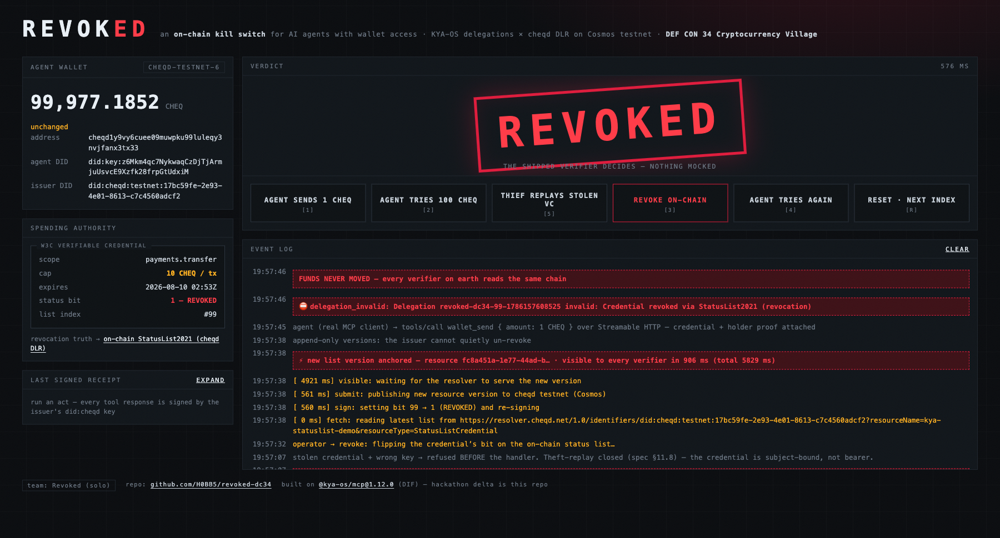
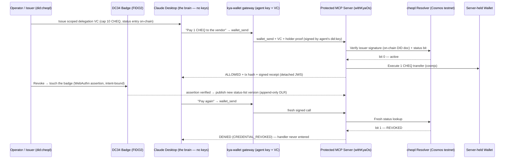

# REVOKED — an on-chain kill switch for AI agents with wallet access

**DEF CON 34 · Cryptocurrency Village Hackathon · team "Revoked" (solo) · built Aug 6–9, 2026**

> Agents spend under cryptographically scoped, verifiable delegations (DIDs +
> Ed25519-signed tool calls), and that spending authority can be revoked on
> Cosmos — stopping a rogue or hijacked agent before it drains a wallet, with
> no server anyone has to trust.



## The demo

The agent is **Claude Desktop** — the same MCP client thousands of people use —
plugged into a local KYA-OS gateway that holds the agent's key and signs each
call. **The LLM never touches key material.** The console is the *verifier's
view*; the wallet never leaves the server (custodian). (No Claude Desktop on
hand? `npm run agent` and the console's simulated-agent buttons drive the exact
same path.)



The beats, all live on stage:

1. **The agent spends, safely.** The agent presents its W3C Delegation
   Credential (scope `payments.transfer`, capped at **10 CHEQ per transfer**
   — the cap lives *in the signed credential*) **plus a per-request holder
   proof signed by its own did:key**. The server runs `holderBinding:
   'enforce'`, so the credential is **subject-bound, not bearer**. Real CHEQ
   moves on cheqd testnet ([explorer](https://testnet-explorer.cheqd.io/transactions/6291B98B875D444D1E5D9ABDEA165DE89B4A9447BD06B7B8F9E730CA99DBFD30)).
   Every response carries a detached-JWS receipt signed by the issuer's
   on-chain key.
2. **Attack theater.** Over-cap send → `SCOPE_CONSTRAINT_VIOLATED` (from the
   credential, not app config). A thief replaying the *stolen credential*
   with their own key → `holder_binding_failed` **before the handler is
   entered** (spec §11.8 theft-replay closure).
3. **The kill switch — gated by hardware.** Revocation isn't a password and a
   button: it requires a live **WebAuthn assertion from the DEF CON 34 badge**
   (FIDO2, inspectable silicon), bound to the revocation's content hash — a
   human, physically present, touching hardware. Only then does it flip the
   credential's bit on a **StatusList2021 credential anchored as a cheqd
   DID-Linked Resource** — a new, append-only version on Cosmos testnet
   (~5–9 s to anchor; resolver serves it in **~550 ms**). *The software agent
   signs with software; the human who can kill it signs with hardware.*
   (Feature-flagged: `BADGE_WEBAUTHN=1`; a software confirm is the fallback.)
4. **The agent tries again.** The very next signed call is refused by the
   *shipped* verifier in ~550 ms: `delegation_invalid — Credential revoked
   via StatusList2021 (revocation)`. **Funds never move.** The issuer cannot
   quietly un-revoke: versions are append-only and globally readable.

## What was built during the hackathon (Aug 6–9) vs. before

Everything in this repository is hackathon-weekend code, written against the
**published** [`@kya-os/mcp@1.12.0`](https://www.npmjs.com/package/@kya-os/mcp)
npm package (the DIF reference implementation for agent identity). No forks,
no patched dependencies.

| Built this weekend (this repo) | Composed from the published package (pre-existing) |
|---|---|
| `src/cheqd-statuslist-resolver.ts` — on-chain StatusList2021 revocation checks: issuer-pinned, Ed25519-verified against the on-chain DID document, purpose-parity, strict index parsing, fail-closed on every anomaly | `StatusListResolver` verifier seam, `DelegationCredentialVerifier`, `withKyaOs` middleware |
| `src/prepare-statuslist-dlr.ts` — vendored `StatusListCredential` DLR prep (type not yet in the library's manifest list; upstream DIF PR planned) | `prepareCheqdDlrResource` semantics, cheqd registrar client + resolver, `canonicalizeJSON`, `base58` utils |
| `src/statuslist-ops.ts` — build / re-sign / publish-as-new-version / wait-visible | `BitstringManager` (W3C bitstring codec), Ed25519 crypto provider |
| `src/server.ts` + `src/wallet-send-tool.ts` — real MCP server (Streamable HTTP, inspector-compatible) with the delegation-gated `wallet_send` (cosmjs bank send), holder binding ENFORCED, SSE event bus, act API | `wrapWithDelegation` / `wrapWithProof` gates, scope matcher, proof generation |
| `src/gateway.ts` — the agent runtime Claude Desktop plugs into: MCP server (stdio + streamable-http) holding ONLY the agent's did:key authority key + VC, signing each outbound call; never loads the funds wallet (balance is a read to the custodian); LLM touches no keys | MCP SDK server/client transports |
| `src/agent.ts` — the signing client the gateway (and simulated buttons) reuse: VC + per-request holder proof (`generateRequestProof`), `--forge` theft-replay mode | `generateRequestProof` (client half of holder binding) |
| `src/badge/*` — badge-gated revocation over WebAuthn: intent-bound challenge (sha256 of the revocation), `@simplewebauthn/server` verify, fail-safe, hardware-attested record | — |
| `web/index.html` — verifier-view console: live gate rail over SSE, badge "touch to authorize" ceremony (native WebAuthn) | — |
| `web/index.html` — the self-contained act console (offline-first; con wifi is not a dependency) | — |
| Operator scripts (`create-did`, `publish-statuslist`, `issue-delegation`, `revoke`, `verify-once`) + WP0 assumption checks + 22-test fail-closed matrix | — |

## On-chain evidence (all real, all testnet)

| Artifact | Value |
|---|---|
| Issuer DID (created via cheqd staging registrar, client-managed keys) | `did:cheqd:testnet:17bc59fe-2e93-4e01-8613-c7c4560adcf2` |
| Status list (version-independent — always resolves the LATEST version) | [`resolver.cheqd.net/1.0/identifiers/did:cheqd:testnet:17bc59fe…?resourceName=kya-statuslist-demo&resourceType=StatusListCredential`](https://resolver.cheqd.net/1.0/identifiers/did:cheqd:testnet:17bc59fe-2e93-4e01-8613-c7c4560adcf2?resourceName=kya-statuslist-demo&resourceType=StatusListCredential) |
| Initial all-clear list version | resource `1df17f08-c847-44f2-8b42-4311a4535fa8` |
| Revocation versions (indices 94–97, burned during rehearsals; every one an append-only on-chain version, timestamped by the ledger) | `4b5091b0…` (94) · `3dd88efc…` (95) · `56a4eb75…` (96) · `90ad572c…` (97) — enumerate them all: [`?resourceMetadata=true`](https://resolver.cheqd.net/1.0/identifiers/did:cheqd:testnet:17bc59fe-2e93-4e01-8613-c7c4560adcf2?resourceMetadata=true) |
| Agent bank sends (through the delegation gate) | [`6491C798…`](https://testnet-explorer.cheqd.io/transactions/6491C798F5FAA8B4E50A53901D3E9610850D21B71AC9516FCE144C3C8EB88DE2), [`6291B98B…`](https://testnet-explorer.cheqd.io/transactions/6291B98B875D444D1E5D9ABDEA165DE89B4A9447BD06B7B8F9E730CA99DBFD30) |
| Measured revocation latency | publish ≈4–8 s · resolver-visible ≈550 ms · refusal ≈550 ms |

## Judge quickstart — verify a real revoked credential in 60 seconds, zero secrets

The burned rehearsal credentials are committed under `examples/judge/`. They
contain no key material; verification needs only the issuer's *public* DID —
the DID document and the revocation list are both read from the chain:

```bash
npm install
npm test                                  # 22-test fail-closed matrix

echo 'CHEQD_DID="did:cheqd:testnet:17bc59fe-2e93-4e01-8613-c7c4560adcf2"' > .env.local
npm run verify:once -- --file examples/judge/delegation-94.json
# → "verdict": "CREDENTIAL_REVOKED"  (exit 1) — live from cheqd testnet
```

That runs the **shipped** `DelegationCredentialVerifier` — signature checked
against the issuer's on-chain DID document, revocation read from the on-chain
status list. Nothing mocked, nothing served by us.

### Full demo (your own issuer + wallets, ~10 minutes)

```bash
cp .env.example .env.local
npm run create:did          # mint a did:cheqd:testnet (staging registrar pays fees)
npm run gen:accounts        # agent + fee wallets; fund via testnet-faucet.cheqd.io
npm run check:a             # PROOF the latest-version resolver semantics hold
npm run check:b             # one real bank send (RPC / chain-id / gas confirmed)
npm run publish:statuslist  # anchor the all-clear list on-chain
npm run issue:delegation    # capped credential at index 94
npm run serve               # verifier + console at http://localhost:4949 (MCP at /mcp)

# The agent — pick one:
npm run gateway             # stdio gateway for Claude Desktop (see docs/OPERATOR.md)
npm run agent -- --amount 1          # or the standalone signing client, over the wire
npm run agent -- --amount 100        # over the in-credential cap → refused
npm run agent -- --amount 1 --forge  # stolen VC, thief's key → holder_binding_failed
```

**Claude Desktop as the live agent:** merge `docs/claude_desktop_config.json`,
restart Claude Desktop, and ask it to "pay 1 CHEQ to the vendor" — full runbook
in [`docs/OPERATOR.md`](docs/OPERATOR.md). Keys on the console (it drives the
same agent): `[1]` send · `[2]` over-cap · `[5]` theft-replay · `[3]` revoke ·
`[4]` retry · `[R]` reset. Or point
[mcp-inspector](https://github.com/modelcontextprotocol/inspector) at
`http://localhost:4949/mcp` and call `wallet_send` yourself — same gate.

## Trust-model delta (why on-chain)

| | Before (issuer-hosted status endpoint) | After (this weekend) |
|---|---|---|
| Identity root | `did:web` → DNS + TLS + a web host | `did:cheqd` on Cosmos testnet |
| Revocation truth | Issuer's server (can lie, go down, be coerced) | On-chain DLR: append-only versions, globally readable, issuer cannot quietly un-revoke |
| Failure mode | Endpoint down → fail closed | Resolver down → fail closed (unchanged) |

## Found during the hackathon (fail-closed is a practice, not a feature)

Rehearsing the act caught four real issues — all fixed and documented in code:

1. **Verifier verdict cache vs. revocation** (upstream finding #1, to be filed
   against `@kya-os/mcp`): `DelegationCredentialVerifier` caches VALID
   verdicts for 60 s and the middleware exposes no bust hook — our rehearsal
   **moved real funds after an on-chain revocation** until the demo server
   learned to rebuild the gate after every revoke. Proposed fix upstream:
   expose `cacheTtl` / a bust hook in `KyaOsDelegationConfig`.
2. **Sessionless holder binding can never verify** (upstream finding #2): the
   shipped `generateRequestProof` defaults a sessionless call to
   `sessionId: ''`, which `validateDetachedProof` then rejects as
   `INVALID_PROOF_STRUCTURE` (non-empty required) — the client half of holder
   binding mints proofs the server half refuses. Workaround: a synthetic
   session id at mint time; replay safety rides on the per-call nonce.
3. **cheqd resolver rejects unknown query params** (`invalidDidUrl`), so
   cache-busting must be header-based; the query endpoint is `cf-cache-status:
   DYNAMIC`, so resolver-side staleness is a non-issue.
4. **dotenv silently truncates `did:…#key-1`** at the unquoted `#` (inline
   comment), which had the verifier hunting for a verification method named
   after the bare DID.

## Upstreaming

- Add `StatusListCredential` to `CHEQD_DLR_ARTIFACT_TYPES` (deletes our
  vendored prep) — DIF working-group PR
- `CheqdDlrStatusListResolver` as a shipped integration + example
- The verifier-cache revocation-latency issue above

## License

Apache-2.0
